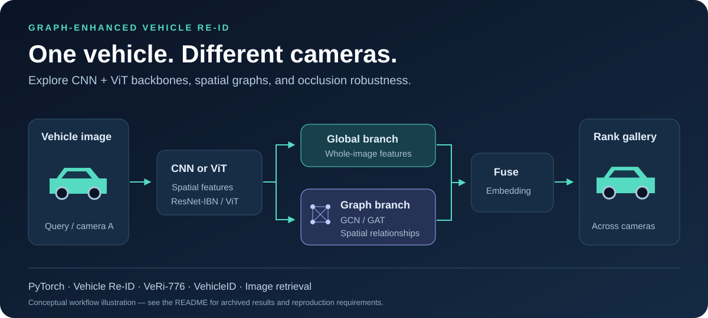

# 图网络增强的车辆重识别 · Vehicle Re-ID

**PyTorch 实现：CNN / Vision Transformer + GCN / GAT，研究跨摄像头车辆检索与遮挡鲁棒性。**

[English](README.md) · [完整运行指南](README.md#-quick-start) · [结果与原始 CSV](README.md#-results) · [脚本说明](scripts/README.md)



## 这个项目解决什么问题？

同一辆车在不同摄像头中可能呈现不同视角、背景或遮挡。**车辆重识别（Vehicle Re-Identification / Vehicle Re-ID）** 根据一张查询图像，对候选车辆图像进行排序，寻找同一辆车。

本项目关注车辆图像的检索表示：把全局视觉特征与空间图特征结合，比较不同模型设计在检索精度和人工遮挡下的表现。

## 可以研究什么？

| 方向 | 当前内容 |
|---|---|
| 视觉骨干 | ResNet50-IBN-a、Vision Transformer（ViT） |
| 图神经网络 | 图卷积网络 GCN、图注意力网络 GAT |
| 空间关系 | 4 / 8 邻域图、k-NN 特征图 |
| 实验维度 | 图网络深度、池化、特征融合、遮挡鲁棒性 |
| 数据集 | VeRi-776、VehicleID |
| 检索指标 | mAP、CMC / Rank-1、Rank-5、Rank-10 |

流程图是原理示意。仓库包含研究代码、配置和部分历史结果；数据集、模型权重和可直接上传图片的在线检索演示需要另外准备。

## 先看结果，再开始运行

[英文 README 的结果表](README.md#-results)链接了 8 个模型、11 个遮挡等级的 VeRi-776 原始 CSV，并分别说明原始 mAP、遮挡后 mAP 和相对下降幅度。VehicleID 表格保留了历史报告数值，其原始结果文件未随仓库提供。

按照[安装与数据准备说明](README.md#-quick-start)配置环境后，在仓库根目录运行：

```bash
python scripts/training/train_bot_gcn.py \
    --config configs/gcn_transformer_configs/abl_cnn_gcn_4nb_l1.yaml
```

训练前检查数据路径和预训练权重配置。车辆重识别评测还需要对应模型检查点。VehicleID 遮挡评测现在将 `small` / `medium` / `large` 分别映射到 800 / 1600 / 2400 身份测试列表；缺少所选文件时会报错。

## 参与项目

欢迎贡献遮挡数据生成、模型加载检查和回归测试。反馈问题时，请提供运行命令、配置、预期行为和实际结果；分享实验时，请注明数据集划分与评测协议。

如果项目对你的车辆重识别研究有帮助，欢迎 Star 收藏，或分享给研究 **Vehicle Re-ID、图神经网络、视觉 Transformer、跨摄像头检索** 的同学。
